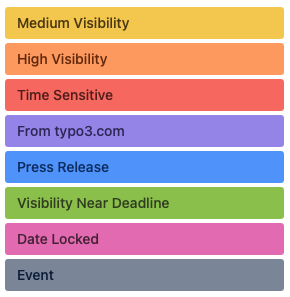

.. include:: /Includes.rst.txt

.. _t3o-pipeline:

=============================
typo3.org Publishing Pipeline
=============================

.. _t3o-pipeline-responsible:

Who is responsible?
===================

The publishing pipeline is managed by the `TYPO3 Content Group <https://typo3.org/community/teams/content>`__.

.. _t3o-pipeline-trello:

Location — Trello board
=======================

The publishing pipeline for news and events on typo3.org is maintained on a `public Trello board <https://trello.com/b/QrnBfQyK/typo3-content-this-is-a-public-board>`__.

.. _t3o-pipeline-stages:

Pipeline stages
===============

The pipeline has eight stages (aka. swim lanes):

.. _t3o-pipeline-stages-content-requests:

Content requests
----------------

New content requests submitted through the `Content Request Form <https://typo3.org/community/teams/communication-coordination/content-request>`__ land in this swim lane.

Cards in this swim lane are unprocessed by the `TYPO3 Content Group <https://typo3.org/community/teams/content>`__.

.. _t3o-pipeline-stages-in-progress:

Content in progress
-------------------

This swim lane holds Trello cards for content that is still being written.

.. _t3o-pipeline-stages-needs-review:

Needs review or proofreading
----------------------------

Trello cards move into this swim lane when the content they represent has been written and is ready for review and proofreading. The Content Group will pick up cards and assign a proofreader.

.. _t3o-pipeline-stages-returned-to-author:

Reviewed and returned to author
-------------------------------

When an article has been proofread, the Trello card representing it is moved into this swim lane. The author is notified by the proofreader and asked to review changes and suggestions.

.. _t3o-pipeline-stages-ready:

Ready to publish
----------------

Once an article's author has reviewed and approved an article for publication, the Trello card representing it is moved into this swim lane. Cards in this lane can be published at typo3.org.

Articles in this swim lane usually have an assigned publication date (indicated by the Trello card's deadline field). The Content Group is responsible for assigning publication dates.

.. _t3o-pipeline-stages-published:

Published and ready for next newsletter
---------------------------------------

After an article or event has been published on typo3.org, the Trello card representing it is moved into this swim lane. The *Published URL* information in the description is updated and the deadline is set to completed.

.. _t3o-pipeline-stages-in-newsletter:

Already published in newsletter
-------------------------------

Once an article has been included in a published newsletter, the Trello card representing it is moved into this swim lane. The card will automatically be archived and disappear from view.

.. _t3o-pipeline-stages-blocked:

Blocked
-------

Trello cards representing articles and events, whose progress is somehow blocked, are manually moved into this swim lane.

.. _t3o-pipeline-labels

Labels
======

Within the Trello board, labels are used to indicate how the news articles or events should be treated.

Labels can be combined, as far as it makes sense.

The labels are listed in the order they have in Trello.

.. _t3o-pipeline-labels-medium-visibility:

Medium Visibility
-----------------

*Color: yellow*

Once published, the article or event should have social media mention.

The exact nature of the visibility outside of typo3.org is decided by the person responsible for social media in the `TYPO3 Company <https://typo3.com/typo3-gmbh>`__.

.. _t3o-pipeline-labels-high-visibility:

High Visibility
---------------

*Color: orange*

A higher level of visibility than for the *Medium Visibility* label. Once published, the article or event should have social media mention at a favorable time, a banner on typo3.org, special graphics, etc.

The exact nature of the visibility outside of typo3.org is decided by the person responsible for social media in the `TYPO3 Company <https://typo3.com/typo3-gmbh>`__.

.. _t3o-pipeline-labels-time-sensitive:

Time Sensitive
--------------

*Color: red*

The item should be published sooner, rather than later.

.. _t3o-pipeline-labels-from-typo3com:

From typo3.com
--------------

*Color: violet*

This article originates at typo3.com and will be linked to the article at typo3.com.

Talk with the person responsible for content publication at the `TYPO3 Company <https://typo3.com/typo3-gmbh>`__ before changing this item.

.. _t3o-pipeline-labels-press-release:

Press Release
-------------

*Color: blue*

This item represents a press release and will be published as such.

Talk with the person responsible for content publication at the `TYPO3 Company <https://typo3.com/typo3-gmbh>`__ before changing this item.

.. _t3o-pipeline-labels-visibility-deadline:

Visibility Near Deadline
------------------------

*Color: green*

This item represents information about a time-limited opportunity, such as a vote or poll. It should be given additional visibility closer to the end of the time-limited period.

The exact nature of the visibility outside of typo3.org is decided by the person responsible for social media in the `TYPO3 Company <https://typo3.com/typo3-gmbh>`__.

.. _t3o-pipeline-labels-date-locked:

Date Locked
-----------

*Color: magenta*

The item's publication date must not be changed.

.. _t3o-pipeline-labels-event:

Event
-----

*Color: dark gray*

The Trello card represents and event, not a news article. Consequently, the information contained in the document should be published as an event, visible in the event listing. Event dates, etc., should be contained within the description text or attached document.
