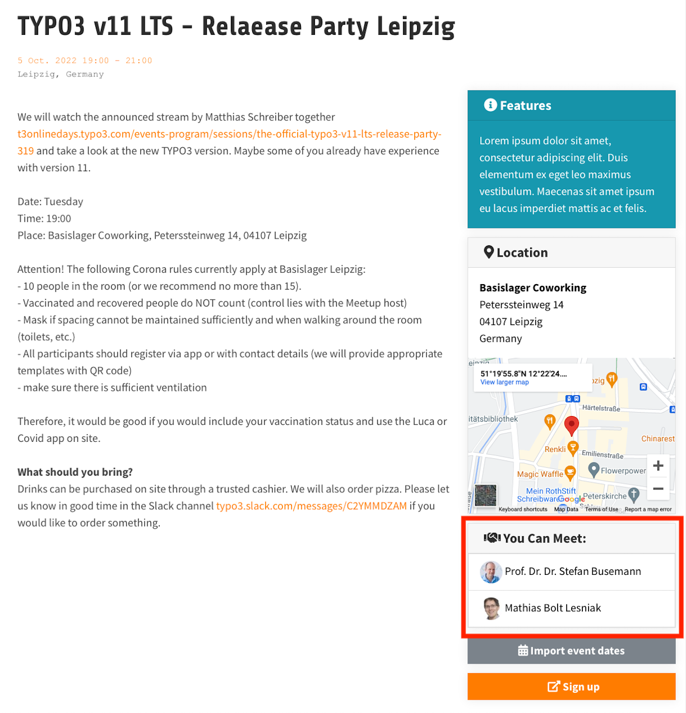

.. include:: /Includes.rst.txt

.. _you-can-meet:

============
You Can Meet
============

*You Can Meet* is an optional section in event listings and on event single-view pages on typo3.org. This is a list of people central to the TYPO3 community who will be taking part in the event.

   An example *You Can Meet* listing in an event single-view on typo3.org.

.. _you-can-meet-outcome:

Desired outcome
===============

By highlighting who you can meet at an event, we hope more people will sign up for the events. We also hope that it will work as an invitation to contact the listed people, thereby increasing community involvement and encouraging contribution.

.. _who-can-be-listed:

Who can be listed
=================

#. TYPO3 Association Board members
#. TYPO3 Association Business Control Committee (BCC) members.
#. TYPO3 Company Supervisory Board members
#. TYPO3 Company or Association Employees (designated by the respective board/CEO)
#. TYPO3 Core Mergers
#. TYPO3 Team Leads and Co-Leads
#. Persons appointed by the TYPO3 Association Board

.. _list-ordering:

Ordering in lists
-----------------

Names are first ordered according to the prominence of a person's role:

#. The role's position the bullet list above.
#. Any prominence within the role. E.g, president before, vice president, treasurer, secretary, and others, and leader over co-leader.
#. Alphabetically, by first name.

This is based on the the assumption that *the people with the most central positions are most important to meet*.

.. _list-limit:

Limit
-----

Only the topmost 10 participants will be listed. This is due to a technical limitation and may be changed in the future.

.. _requirements:

Requirements
============

If you're in the list, you're no longer just representing yourself and your company, but you're also a face for people new to TYPO3 to approach about our beloved CMS.

As a representative of TYPO3, you must follow `TYPO3's Code of Conduct <https://typo3.org/coc>`__ and the Code of Conduct of the event. When the two codes conflict, the strictest of the codes should be followed.
